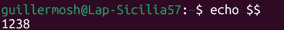

# Code, Learn & Practice(Programación de Servicios y Procesos: "Procesos")
## Bloque 1: Conceptos básicos (teoría)
1. El programa es un código guardado en un disco duro para una fase previa del proceso. El proceso es un evento de ese programa en ejecución.
    > https://www.profesionalreview.com/2020/06/20/cual-es-la-diferencia-entre-un-programa-y-un-proceso/

2. El kernel o núcleo de un SO se encarga de la funcionalidad básica del sistema, el responsable de la gestión de los recursos del ordenador, se accede al núcleo a través de las llamadas al sistema, es la parte más pequeña del sistema en comparación con la interfaz.
    > https://github.com/jpexposito/code-learn/blob/main/segundo/pgv/1-concurrente/PROCESOS-SO.md

3. PID es el id de un proceso y PPID es el id del proceso padre. Un ejemplo sería un navegador (Firefox) en el que tiene un proceso padre con un PID y varios procesos hijos (por cada ventana) con otros PIDs propios.
    > Conocimiento propio

4. Los cambios de contexto en programación hacen referencia a la acción de detener la ejecución de un proceso actual en un sistema operativo y cambiar al proceso seleccionado. Es costoso porque primero hay que guardar el estado del proceso anterior para poder después ejecutar el nuevo proceso o abrir otro que no estaba cargado.
    > https://keepcoding.io/blog/cambios-de-contexto-en-programacion/#%C2%BFQue_son_los_cambios_de_contexto_en_programacion

5. PCB es una estructura de datos usada por el Sistema Operativo para realizar un seguimiento de la información de los procesos y administrar su ejecución.
    > https://www.geeksforgeeks.org/operating-systems/process-table-and-process-control-block-pcb/

6. Un proceso padre es iniciado por un programa o mandato y puede tener varios procesos hijos productos de ese proceso, pero un proceso hijo solo puede tener un proceso padre.
    > https://www.ibm.com/docs/es/aix/7.2.0?topic=processes-

7. Este caso se da cuando un proceso padre es matado (killed) y el proceso hijo se queda huérfano. En estas situaciones, son tomados por el proceso init y aunque estén bajo otro proceso se les sigue llamado Huérfanos.
    > https://fraterneo.wordpress.com/2012/02/19/tipos-de-procesos-en-linux-child-daemon-orphan-y-zombie/

8. Un proceso zombie es cuando el proceso hijo es terminado o completa su ejecución, liberando toda su memoria y recursos asociados, y se queda a la espera de que el proceso padre reciba la información de que ha terminado el proceso hijo.
    > https://fraterneo.wordpress.com/2012/02/19/tipos-de-procesos-en-linux-child-daemon-orphan-y-zombie/

9. La principal diferencia del paralelismo contra la concurrencia es que, en el paralelismo, todos los procesos concurrentes están íntimamente relacionados a resolver el mismo problema, de tal forma que el resultado de los demás procesos afecta al resultado final.
    > https://www.oscarblancarteblog.com/2017/03/29/concurrencia-vs-paralelismo/

10. A diferencia de un proceso, los threads son entidades mucho más pequeñas, lo cual los hace fácilles de gestionar, tanto es así que un thread es la unidad más pequeña a la cual un procesador puede asignar tiempo.
    > https://codigofacilito.com/articulos/threads-procesos

## Bloque 2: Práctica con comandos en Linux

11.

12.

13. Estamos buscando el PID del proceso systemd, primer proceso iniciado por distros GNU/Linux después del núcleo, encargandose de inicializar y gestionar el resto del sistema.

14.

15. 
- PID: Id del proceso
- TTY: Terminal asociado al proceso
- Time: Tiempo de CPU usado
- CMD: Nombre del proceso

16.

17.

18.

19.

20.

## Bloque 3: Procesos y jerarquía

21. systemd/init es el es el encargado de inicializar y gestionar el resto del sistema:

22. Pasaria a ser un proceso huérfano y es "adoptado" por el proceso init

23. 

24.

25.

26.
- Running: en ejecución o listo para ejecutarse
- Sleeping: en espera de un evento
- Stopped: detenido o bajo control de depuración
- Zombie: terminado cuyo estado aún no ha sido recogido por el proceso padre

27.

28.

29. Con '&' el proceso solo se envia a segundo plano y cuando se cierre la temrinal se detendrá, mientras que nohup permite que el proceso siga ejecutándose aunque se haya cerrado la sesión.

30.
